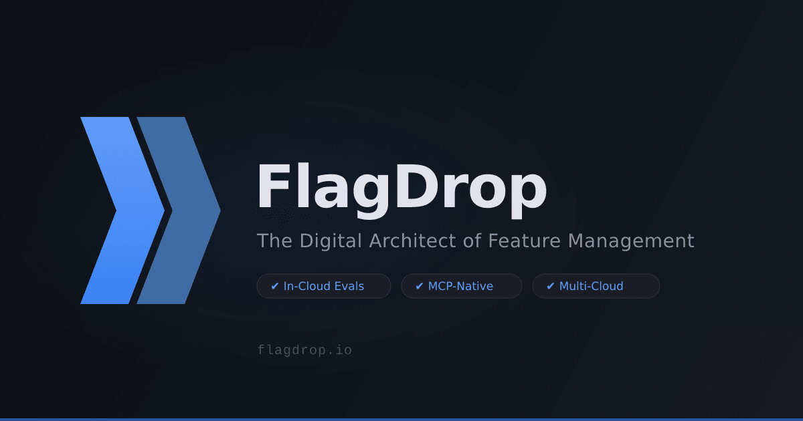

<p align="center">
  
</p>

<p align="center">
  <strong>Feature flags that run where your code runs.</strong><br/>
  We push config. You evaluate locally. Your data never leaves your cloud.
</p>

<p align="center">
  <a href="https://flagdrop.io">Website</a> &middot;
  <a href="https://flagdrop.io/docs">Documentation</a> &middot;
  <a href="https://flagdrop.io/pricing">Pricing</a> &middot;
  <a href="https://platform.flagdrop.io/waitlist">Get Early Access</a>
</p>

---

### How it works

<table>
<tr>
<td align="center" width="20%"><strong>FlagDrop</strong><br/><sub>Control Plane</sub></td>
<td align="center" width="10%">&#8594;<br/><sub>Config Push</sub></td>
<td align="center" width="20%"><strong>Your Cloud</strong><br/><sub>S3 / GCS / Azure</sub></td>
<td align="center" width="10%">&#8594;<br/><sub>Local Read</sub></td>
<td align="center" width="20%"><strong>Your App</strong><br/><sub>flags.get_bool()</sub></td>
</tr>
</table>

FlagDrop pushes JSON config files to your cloud storage bucket. Your applications read flags locally using our lightweight SDKs. No proxy servers, no third-party network calls, no data leaving your infrastructure.

### SDKs

| Package | Language | Install |
|---------|----------|---------|
| [`@flagdrop/sdk`](https://github.com/flagdrop-io/sdk-node) | Node.js / TypeScript | `npm install @flagdrop/sdk` |
| [`flagdrop-sdk`](https://github.com/flagdrop-io/sdk-python) | Python | `pip install flagdrop-sdk` |
| [`@flagdrop/browser`](https://github.com/flagdrop-io/sdk-browser) | Browser / React | `npm install @flagdrop/browser` |
| [`@flagdrop/openfeature`](https://github.com/flagdrop-io/openfeature-provider) | OpenFeature | `npm install @flagdrop/openfeature` |

### Quick start

```typescript
import { FlagClient } from '@flagdrop/sdk'

const flags = new FlagClient({
  bucket: 'my-app-flags',
  environment: 'production',
  provider: 'aws',
  region: 'us-east-1',
})

await flags.initialize()

const enabled = await flags.getBool('new-checkout', false)
const theme = await flags.getString('app-theme', 'light', { userId: 'user-123' })
```

### Why FlagDrop

| | FlagDrop | Traditional providers |
|---|---|---|
| **Evaluation** | In your cloud, zero latency | Via their proxy, adds latency |
| **Data residency** | Your bucket, your rules | Their servers, their terms |
| **Multi-cloud** | S3, GCS, Azure per environment | Usually single provider |
| **Pricing** | Flat per-project, unlimited evals | Per-seat or per-eval metering |
| **Targeting** | Rules, segments, rollouts | Rules, segments, rollouts |
| **OpenFeature** | Provider available | Varies |

### Links

- [flagdrop.io](https://flagdrop.io) -- Marketing site
- [Documentation](https://flagdrop.io/docs) -- Quickstart, SDK reference, API docs
- [Pricing](https://flagdrop.io/pricing) -- Simple per-project pricing
- [Status](https://flagdrop.io/status) -- Platform status
